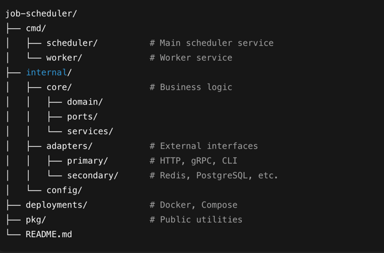
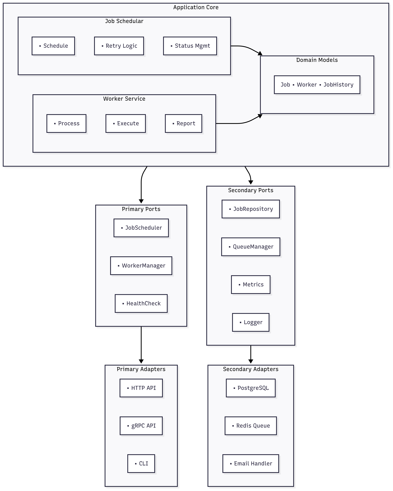
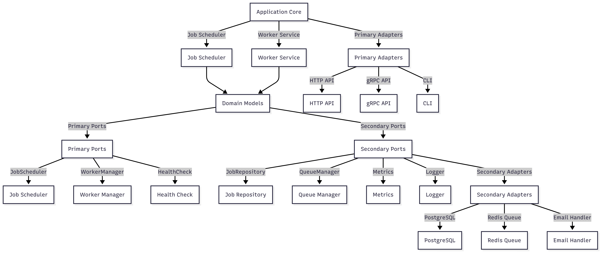
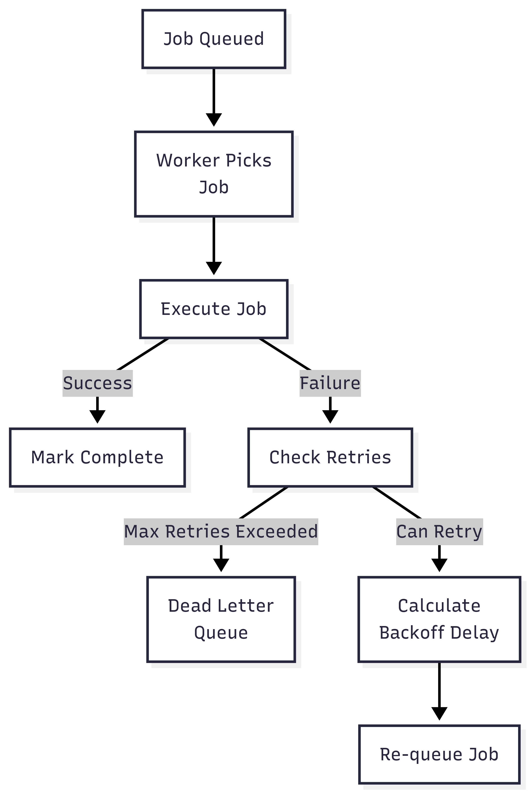

Project Structure

# How to Run

### Setup Dependencies:

### `go mod init job-scheduler-service`

### `go mod tidy`

### Start Infrastructure:

### `docker-compose up -d`

### Run the System:

#### go run . # Main scheduler + worker
#### OR
#### go run . -mode=worker # Worker only

Use the API:

### Schedule a job
`'curl -X POST http://localhost:8080/api/v1/jobs \
-H "Content-Type: application/json" \
-d '{"job_type":"email","payload":{"to":"test@example.com","subject":"Test","body":"Hello","from":"noreply@example.com"}}'
`
### Check queue stats
curl http://localhost:8080/api/v1/queues/stats

#### I've designed a comprehensive distributed job scheduling system using Hexagonal Architecture that addresses the requirements.
### Here are the key highlights:
## Architecture Highlights

* Separation of Concerns: Clear separation between scheduler, workers, and queue management
* Fault Tolerance: Workers can fail without affecting the system
* Scalability: Add more workers by simply running additional processes
* Observability: Complete job lifecycle tracking and metrics
* Business Flexibility: Easy to add new job types and handlers
* Tech Flexibility : Easy to swap or integrate new port for storage (Postgres, MongoDB)  and queue (Redis,RabbitMQ,SQS, KAKFA)
### Core Architecture Benefits
1. Clean Domain Logic: The Job, RetryPolicy, and Priority entities contain pure business logic with no infrastructure dependencies.
2. Flexible Adapters: Easy to swap Redis for SQS, memory storage for Postgres, or add new job handlers without touching core logic.
3. Production Ready: Includes proper error handling, metrics collection, graceful shutdown, and configurable retry policies with exponential backoff.
### Key Features Implemented
* Priority Queues: Critical → High → Medium → Low processing order
* Delayed Jobs: Schedule jobs for future execution with automatic promotion
* Retry Logic: Configurable retry policies with exponential backoff
* Dead Letter Queue: Failed jobs after exhausting retries
* Worker Management: Horizontal scaling with heartbeat monitoring
* Comprehensive Monitoring: Metrics and structured logging hooks

### Production Deployment
#### The system is designed to scale horizontally:

* Multiple scheduler instances for high availability
* Worker pools that can be scaled independently
* Queue-based job distribution for load balancing
* Database persistence for job state and history

🧪 Development Friendly
* Memory implementations for local development
* Clear interfaces make it easy to add new job types
* Comprehensive test examples included

#### The architecture follows Go idioms while maintaining clean separation between business logic and infrastructure concerns. 
#### We can start with the in-memory adapters for development and seamlessly switch to Redis/Postgres for production.

## High Level Architecture Diagram

## FLowchart Diagram

### Retry logic flow

### Database Schema are located in /scripts